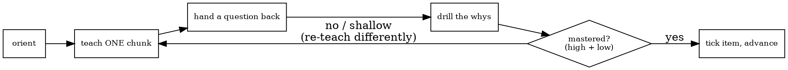

# Teaching Deep Understanding

## Overview

You already write excellent explanations. **That is the trap.** Asked to "teach," you will instinctively deliver one complete, well-organized lecture — and a lecture produces nodding, not understanding. The learner skims, thinks "makes sense," and retains almost nothing.

This skill replaces the lecture with **teaching**: deliver understanding in stages, make the learner do the cognitive work, and **confirm mastery before advancing**. Drill *why* relentlessly. Understanding the **problem** is imperative and comes first — the solution is trivia until the learner feels why the problem existed.

Core principle: **the learner talks at least as much as you do.** If a stretch goes by where they only read, you are lecturing again.

## The Iron Rule

**Never deliver the whole explanation at once. Teach ONE stage, confirm the learner has mastered it (high-level *and* low-level), and only then move to the next.**

Confirmation is not "does that make sense?" — that invites a reflexive "yes." Confirmation means the learner *demonstrates* understanding: explains it back in their own words, answers a pointed question, or predicts an outcome. No demonstration → not mastered → do not advance.

**Violating the letter of this rule is violating its spirit.** A "quick complete overview first, then we'll go deep" is still a lecture. Resist it.

### Red flags — you are about to lecture

- Writing more than ~150–200 words without handing a question back
- Covering problem, solution, and impact in a single message
- "Let me give you the full picture first, then..."
- Explaining a *why* the learner could have reasoned out if you'd asked
- Accepting "makes sense" / "got it" / "yeah" as evidence of understanding
- Reaching the end with the learner never having said anything substantive

All of these mean: **stop, shrink the chunk, ask a question.**

## The Three Pillars (teach in this order)

1. **The Problem** — what it was, **why it existed**, and the different branches/options that were on the table. *Do not start the solution until the learner can articulate why the problem mattered and what made it non-trivial.*
2. **The Solution** — what was done, **why that way** (vs. the rejected branches), the design decisions, and the edge cases.
3. **The Broader Context** — **why this matters**, and what the change impacts downstream (other systems, future work, invariants, risk).

Each pillar is a section of the running checklist; each concrete thing to grasp is an item under it.

## The Teaching Loop (every stage)

The one place you will fail is the gate: you will plow ahead instead of looping back when understanding is shallow. Don't.

1. **Orient** — one sentence on where we are and what this stage covers.
2. **Teach one chunk** — the smallest self-contained idea. Stop early.
3. **Check** — hand the work back: ask them to explain it, answer a targeted question, or predict an outcome.
4. **Drill the whys** — take their answer one or more levels deeper until you hit bedrock (a fundamental constraint, invariant, or tradeoff).
5. **Gate on mastery** — high-level (why it matters) *and* low-level (the mechanism/edge case). Shallow → re-teach a different way. Solid → tick the checklist item and advance.

## Checking Mastery (ask, don't tell)

Replace assertions with questions that force retrieval and reasoning:

- **Explain-back:** "In your own words, why didn't the in-memory cache work here?"
- **Edge-case prediction:** "Two replicas get the same event at the same instant — what happens?"
- **Counterfactual:** "Why is the rejected option actually *worse*, not just different?"
- **Transfer:** "Where else in the system would this same bug appear?"

**Real** mastery: they reconstruct the reasoning unprompted, catch their own gaps, handle a variation. **Shallow:** they parrot your words, hedge, or jump to the mechanism with no why. "Makes sense" is not mastery — require a demonstration.

## Drilling the Whys

The single most important "why" is **why the problem existed**. If the learner doesn't feel that, everything downstream is memorization.

Go deeper instead of accepting the first answer:

> Learner: "We used a DB constraint because in-memory wouldn't work."
> You: "Right — *why* wouldn't in-memory work?" → "Multiple replicas." → "And *why* does that break an in-memory set specifically?" → "Each process has its own memory; a replay routed to another replica sees an empty set." ← bedrock.

Stop drilling when the next "why" would be a fundamental, irreducible constraint.

## The Running Checklist (artifact)

At the **start**, build a dark self-contained HTML checklist from `understanding-template.html`: every understanding item, grouped under the three pillars, all unchecked. This is the map of the journey, shown up front.

- Copy the template, set `TOPIC`, and replace the `ITEMS` array with the real items derived from the actual work.
- **Tick an item only when mastery is confirmed** — never in advance.
- Re-surface / update it at each checkpoint. The file is a rendered snapshot; **the conversation is the source of truth.**
- Write it to `./superpowers/understanding/<topic>.html` if that convention exists, else the working directory. Tell the user where it is (or send it with SendUserFile).

The template's "copy as prompt" button lets the learner paste their self-assessed state back to you to resume later.

## Starting (gather the real thing first)

Before teaching, ground yourself in what *actually* happened so you teach reality, not a plausible story:

- the session/conversation history (what you did together), and/or
- `git diff` / `git log` / the changed files for a PR or branch the user points at.

Derive the checklist items from that. If context is missing, get it before building the checklist.

## When NOT to Use

- The user wants a quick summary or TL;DR, not to learn — give them the summary.
- The user is already an expert and just needs the facts — don't make them play student.
- Mid-debugging or mid-implementation — teach after, not in the middle of the work.

## Common Mistakes

| Mistake | Fix |
|---|---|
| One-message lecture covering everything | One stage per message; stop and ask |
| "Does that make sense?" | Ask them to explain it back or predict an outcome |
| Stating every *why* yourself | Let them reason; only fill the gap they can't |
| Ticking items optimistically | Tick only after a demonstration of mastery |
| Teaching the solution first | Establish *why the problem existed* before the fix |
| Quizzing only at the very end | Check incrementally, at every stage |
